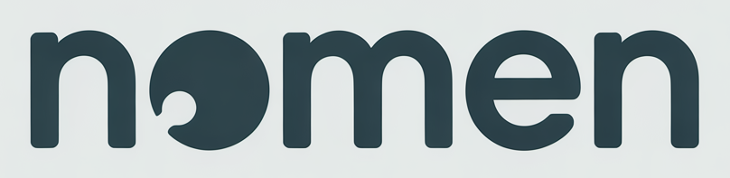

# Nomen

<p align="center">
  
</p>

**Scoped memory for AI agents on Nostr.**

Nomen gives AI agents persistent, searchable, shareable memory using [Nostr](https://nostr.com) as the sync layer. Memory is scoped by visibility — from public knowledge to agent-private reasoning — and signed with the agent's keypair. No vendor lock-in, no central database. Your memory travels with your keys.

## Features

### Five Visibility Tiers

| Tier | Scope | Encryption | Use Case |
|------|-------|-----------|----------|
| **Public** | All agents on relay | None | General knowledge, facts |
| **Group** | NIP-29 group members | Relay-gated | Team decisions, project context |
| **Circle** | Ad-hoc participant set | Shared symmetric key | Shared project notes |
| **Personal** | Agent + specific user | NIP-44 self-encrypt | User preferences, history |
| **Private** | Agent only | NIP-44 self-encrypt | Reasoning, self-reflection |

### Hybrid Search + Knowledge Graph

- **Semantic + full-text** — HNSW vector similarity + BM25, weighted and composable
- **Graph-aware retrieval** — Traverses entity connections, contradictions, and provenance chains (`--graph`, configurable `--hops`)
- **Entity extraction** — Heuristic + LLM-powered with typed relationships
- **Cluster fusion** — Groups related memories by namespace and synthesizes summaries
- **Confidence decay** — Unaccessed memories lose ranking weight over time

### Sleep-Inspired Consolidation

Collected messages flow in from conversations. Consolidation extracts signal from noise:

```
Collected Messages → grouping → LLM extraction → merge/dedup → Named Memories
```

- Visibility derived from source (DM → personal, group chat → group)
- Checks existing memories by topic + embedding similarity, merges instead of duplicating
- LLM flags contradictions, creates graph edges
- Automatic entity extraction during consolidation

### Four Integration Paths

| Path | Transport | Best For |
|------|-----------|----------|
| **MCP Server** | stdio | Agent frameworks with MCP support |
| **HTTP** | REST | Remote agents, web UI |
| **ContextVM** | Nostr (NIP-44/59) | Nostr-native agents, decentralized access |
| **Socket** | TCP/Unix | Local shared access, push events |

All transports route through the same canonical dispatch layer.

### Nostr Event Model

Memories are **kind 31234** addressable replaceable events. D-tag encodes namespace and topic:

```
{tier}/{scope?}/{topic}
```

```json
{
  "kind": 31234,
  "content": "Use anyhow for application errors. Prefer anyhow::Result for ergonomic error propagation.",
  "tags": [
    ["d", "public/rust-error-handling"],
    ["visibility", "public"],
    ["scope", ""],
    ["model", "anthropic/claude-opus-4-6"],
    ["version", "1"],
    ["t", "rust"],
    ["t", "error-handling"]
  ]
}
```

Content is plain text/markdown. D-tag examples:

```
public/rust-error-handling
private/agent-reasoning
personal/d29fe7c1.../ssh-config
group/techteam/deployment-process
circle/a3f8b2c1e9d04712/shared-notes
```

Collected messages from any platform are stored as **kind 30100** events using the canonical hierarchy: `platform → community? → chat → thread? → message`.

### Web Dashboard

- Memory browser with search
- Consolidation status + trigger
- Entity and graph explorer
- Config viewer + reload

## Install

```bash
git clone https://github.com/k0sti/nomen.git
cd nomen
cargo build --release
```

No external database — SurrealDB runs embedded.

## Quick Start

```bash
# Interactive setup
nomen init

# Store a memory
nomen store "rust/error-handling" --content "Use anyhow for app errors" --tier public

# Search (hybrid vector + BM25)
nomen search "error handling"
nomen search "error handling" --graph --hops 2

# Ingest + consolidate
nomen ingest "k0 mentioned switching to Tailscale" --source telegram --sender k0 --chat "-1001234"
nomen consolidate

# Entity extraction and cluster fusion
nomen entities --relations
nomen cluster --dry-run

# Start servers
nomen serve --stdio                          # MCP
nomen serve --http 127.0.0.1:3000            # HTTP + web UI
nomen serve --context-vm                     # Nostr-native
nomen serve --socket /tmp/nomen.sock         # Local socket
nomen serve --http :3000 --context-vm        # Combined
```

## Architecture

```
              Nostr Relay (kind 31234 — source of truth)
                      │
                 sync (NIP-42/44)
                      │
                  ┌───┴───┐
                  │ Nomen │
                  └───┬───┘
                      │
                  SurrealDB (embedded cache)
                ┌─────┼─────┐
                │     │     │
              docs  vectors  graph
              BM25  HNSW    edges
                │     │     │
        ┌───────┴─────┴─────┴───────┐
        │       │       │     │     │
       CLI   Library   MCP  HTTP  ContextVM  Socket
```

Nostr relay is the source of truth. SurrealDB is a local index. If local state is lost, `nomen sync` recovers everything.

## CLI Reference

| Command | Description |
|---------|-------------|
| `nomen init` | Interactive setup wizard |
| `nomen doctor` | Validate config and connectivity |
| `nomen store <topic>` | Store a memory |
| `nomen search <query> [--graph] [--hops N]` | Hybrid search |
| `nomen list [--named\|--stats]` | List memories |
| `nomen delete <topic>` | Delete a memory (NIP-09 + local) |
| `nomen sync` | Sync relay → local DB |
| `nomen ingest <content>` | Ingest collected message |
| `nomen messages [--platform] [--chat] [--thread]` | Query messages |
| `nomen consolidate [--dry-run]` | LLM consolidation pipeline |
| `nomen entities [--kind] [--relations]` | Entity explorer |
| `nomen cluster [--dry-run]` | Cluster fusion |
| `nomen prune [--days N] [--dry-run]` | Prune old data |
| `nomen group create\|list\|members` | Manage groups |
| `nomen send <content> --to <recipient>` | Send via Nostr |
| `nomen serve [--stdio\|--http\|--socket\|--context-vm]` | Start server |
| `nomen embed [--limit N]` | Generate missing embeddings |
| `nomen fs init\|pull\|push\|start` | Filesystem sync |

## Configuration

```toml
relay = "wss://your-relay.example.com"
nsec = "nsec1..."

[embedding]
provider = "openai"
model = "text-embedding-3-small"
api_key_env = "OPENAI_API_KEY"

[memory.consolidation]
enabled = true
provider = "openrouter"
model = "anthropic/claude-sonnet-4-6"
api_key_env = "OPENROUTER_API_KEY"

[entities]
provider = "openrouter"
model = "anthropic/claude-sonnet-4-6"

[memory.cluster]
enabled = true
min_members = 3

[server]
listen = "127.0.0.1:3000"

[contextvm]
enabled = false
```

## Specs

See [docs/](docs/README.md) for full specifications:

- **[spec/overview](docs/spec/overview.md)** — system purpose, data flow, storage
- **[spec/data-model](docs/spec/data-model.md)** — memory events, collected messages, tags
- **[spec/api](docs/spec/api.md)** — canonical API reference
- **[spec/consolidation](docs/spec/consolidation.md)** — pipeline spec
- **[spec/identity](docs/spec/identity.md)** — multi-user, access control, encryption
- **[spec/transport](docs/spec/transport.md)** — MCP, HTTP, ContextVM, socket
- **[spec/security](docs/spec/security.md)** — auth, encryption, key management

## Origin

**Nomen** = **No**str **Mem**ory **N**etwork.

## License

MIT
